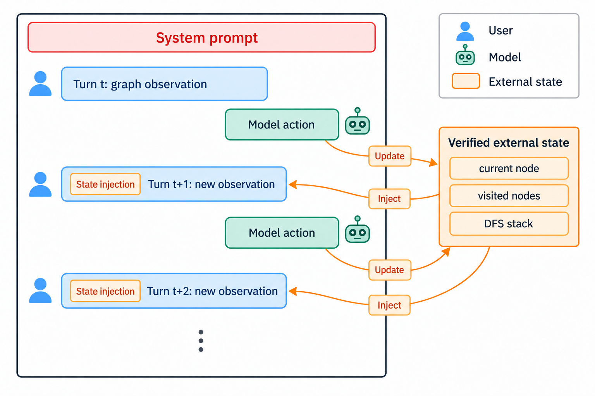
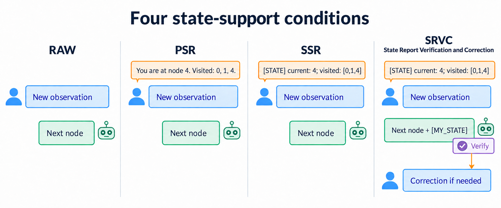
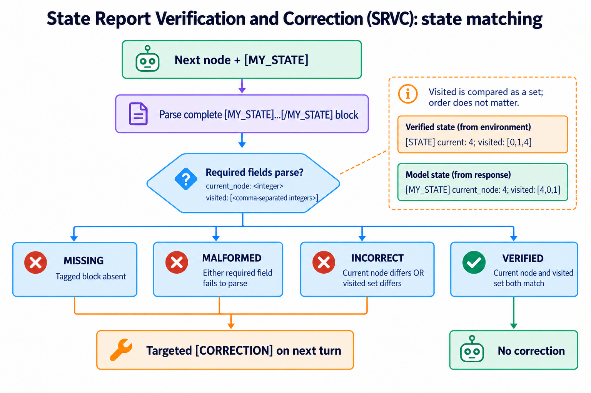
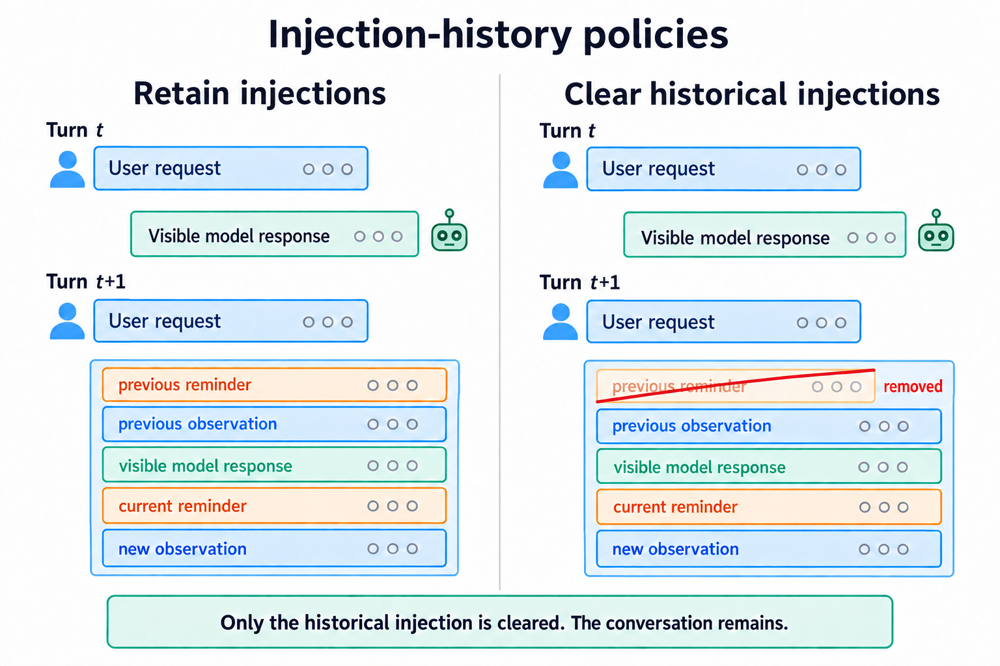

# From Conversation History to Task State: Diagnosing Specialized Small Language Model Agents under Incremental Observation

Apurbo Banik Turjo

**Collaborators:** Sushmita Paul, Dr. Ch. Md. Rakin Haider

Maintained research workspace. Updated September 2026. Work in progress.

This is a public overview of an ongoing study. Results, exact prompts, traces,
and implementation details will remain private until they are ready to share.

## Abstract

Small language models are useful when compute, cost, or privacy matters. But a
model that answers one prompt well may still lose track of a task over a long
interaction. It has to remember earlier steps, update its state as new
information arrives, and recover when something goes wrong.

The project asks:

> **How should an interactive system represent and manage state so that a small
> language model can reason more reliably over many turns?**

I study external state support, conversation history, and state verification
in partially observed tasks. Interactive BFS and DFS give us a controlled way
to observe these problems. They are test cases, not the wider goal of the
research.

## Why this matters

Many agents work one step at a time. A tool result, user reply, test failure, or
environment change reveals information needed for the next step. A specialized
SLM can keep a task-specific registry instead of reconstructing everything from
a growing conversation. Facts visible to the surrounding system can also be
checked when needed.

This idea is relevant to:

- tool-using agents that must track calls, results, dependencies, and pending work;
- troubleshooting systems that keep test results and possible causes;
- task-oriented assistants that collect information and complete a workflow;
- software and data agents that track files, tests, transformations, and remaining steps.

The aim is to locate the actual failure. Did the model misunderstand new
information, lose the task state, update its plan incorrectly, choose the wrong
action, or fail to recover after feedback?

## The interaction problem

At each turn, the model receives a local observation and chooses its next
action. The environment keeps a verified record of the task. We test whether
that record should be returned to the model and how it should be presented.

This lets us observe failures such as forgetting earlier decisions, confusing
the current state, repeating work, breaking the required procedure, and failing
to recover from an error.

## Four forms of state support

| Condition | What happens |
|---|---|
| **RAW** | The model receives only the current observation. |
| **PSR: Prose State Reminder** | Verified state is restated in plain language. |
| **SSR: Structured State Reminder** | The same state is provided in a tagged block. |
| **SRVC: State Report Verification and Correction** | The model reports its state estimate. The system checks it and gives targeted feedback when needed. |

These conditions help us ask whether external state helps, whether its format
matters, and whether explicit state reports support verification and recovery.

## How SRVC works

Under SRVC, the model reports its current node and visited nodes. The system
compares that report with the verified environment state. A report can be:

- **missing:** the state block is absent;
- **malformed:** a required field cannot be read;
- **incorrect:** the reported state does not match;
- **verified:** the reported state matches.

If the check fails, the next turn includes a focused correction. This lets us
study both the original state error and what happens after feedback.

## Why conversation history matters

A reminder may help now but become stale later. We compare two policies:

- **retain injections:** old state reminders stay in the conversation;
- **clear historical injections:** each reminder is removed after its turn.

Earlier observations and visible model replies remain in both cases. Only the
injected reminder is cleared.

## Research questions

1. How does external state support affect long-horizon behavior in small language models?
2. Does structured state work differently from the same information in prose?
3. What changes when old state injections are retained or cleared?
4. What state-report errors occur, and when does correction help?

## Observations so far

These are early observations from the experiments and reasoning traces. They
will be tested more carefully in the final analysis.

1. **Smaller models often get stuck in verification loops.** An SLM may reach
   the correct result and still continue checking the same reasoning instead
   of committing to an answer. This appears more often in the smaller models.
   Limited model capacity and a narrower range of learned reasoning patterns
   are possible explanations, but the trace analysis is still in progress.
2. **A clear system prompt matters.** The prompt needs to describe the
   specialized task and the current interaction precisely. In one early setup,
   models did not understand that the solution should unfold across multiple
   turns. They tried to simulate the whole interaction inside every response.
   A concise and clearer system prompt reduced this behavior.
3. **Verbosity is difficult to control, but it can sometimes help.** Models do
   not always follow the requested response format and may produce much more
   reasoning than needed. At the same time, those visible explanations remain
   in later context and can support subsequent reasoning through in-context
   self-conditioning. Verbosity can therefore be either useful or harmful,
   depending on what the model preserves.
4. **SLMs struggle to maintain algorithmic working state internally.** This is
   especially visible in BFS, where we intentionally did not provide the
   ordered queue and required the model to maintain it. Performance remained poor.
   DFS improved noticeably when the current stack was supplied. This is not a
   direct comparison of BFS and DFS difficulty because the two tasks received
   different levels of algorithmic state support. Instead, it suggests that
   externalizing task-relevant working state can substantially change SLM
   behavior.

## Working plan

### Done

- [x] Define the study.
- [x] Build the four state conditions.
- [x] Add the two history policies.
- [x] Set the evaluation measures.

### In progress

- [ ] Finish the matched runs.
- [ ] Check runs and provenance.
- [ ] Summarize the results.

### Next

- [ ] Apply an LLM judge to extract general metrics from results and reasoning traces.
- [ ] Study SRVC errors and recovery.
- [ ] Write the results and limitations.
- [ ] Prepare the public artifacts.

## Evaluation

The main measures come from the environment, including completion, traversal
correctness, valid actions, and recovery. Trace analysis will help explain how
the model reached those outcomes. Any model-based judgment will be checked
against human-reviewed examples before it is treated as evidence.

## What is not public yet

The study is still in progress, so this repository does not currently include:

- quantitative results or model rankings;
- exact prompts or decoding settings;
- unreleased traces or run manifests;
- implementation details still being checked.

Validated results, statistical comparisons, and reproducible artifacts will be
added when they are ready.

---

**Apurbo Banik Turjo** · Dhaka, Bangladesh  
[GitHub](https://github.com/excellencior) · [Portfolio](https://abturjo.onrender.com/) · [LinkedIn](https://www.linkedin.com/in/apurbo-banik-turjo-86b5b3328/) · [Email](mailto:turjob44@gmail.com)
